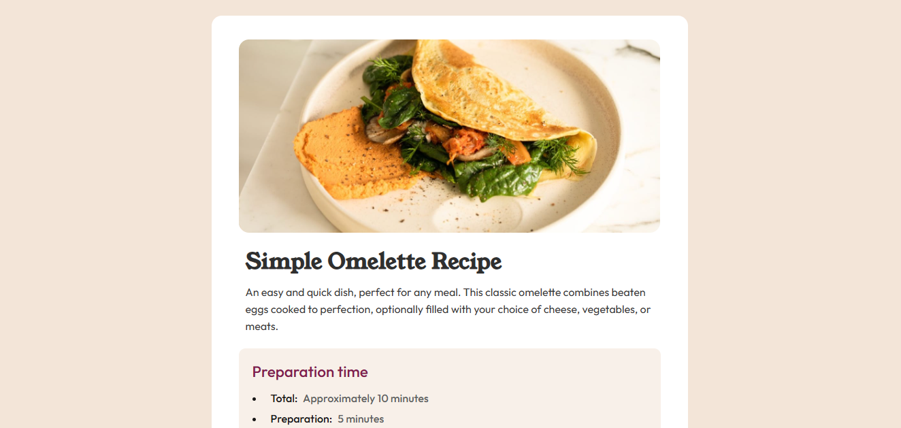

# Frontend Mentor - Recipe page

This is a solution to the [Recipe page on Frontend Mentor](https://www.frontendmentor.io/challenges/recipe-page-KiTsR8QQKm).  
Frontend Mentor challenges help you improve your coding skills by building realistic projects.

---

## 📸 Screenshot

---

## 🔗 Links

- **Solution URL:** [https://www.frontendmentor.io/solutions/recipe-page-hHnLnGuXDQ](#)
- **Live Site URL:** [https://fransantos103.github.io/frontendMentorEasy-Recipe-page/](#)

---

## 💻 My process

### Built with
- Semantic **HTML5** markup  
- **CSS3** (fonts)  
- Responsive design principles  

---

## 🧠 What I learned

While working on this project, I reinforced my understanding of:
- Using **semantic HTML** (`<main>`, `<section>`,`<ul>`, `<ol>`, `<table>`)
- Designing **consistent color palettes**

Here’s a little code snippet I’m proud of:

      <table>
        <tbody>
        <tr>
          <td class="nutritionLabel">Calories</td>
          <td class="nutritionValue">277kcal</td>
        </tr>

        <tr>
          <td class="nutritionLabel">Carbs</td>
          <td class="nutritionValue">0g</td>
        </tr>

        
        <tr>
          <td class="nutritionLabel">Protein</td>
          <td class="nutritionValue">20g</td>
        </tr>

        <tr>
          <td class="fat nutritionLabel">Fat</td>
          <td class="nutritionFatValue nutritionValue">22g</td>
        </tr>
        </tbody>
      </table>
